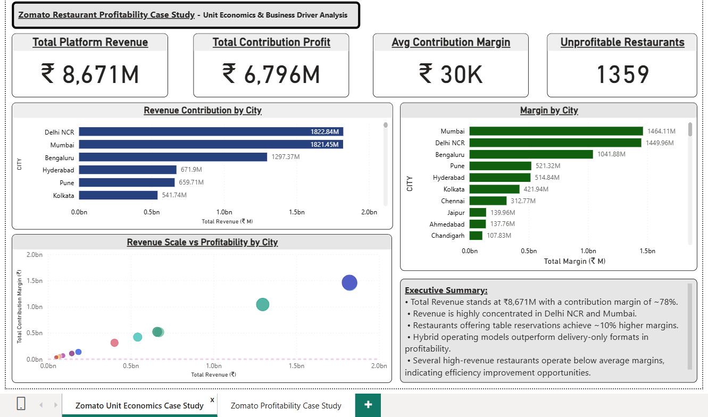
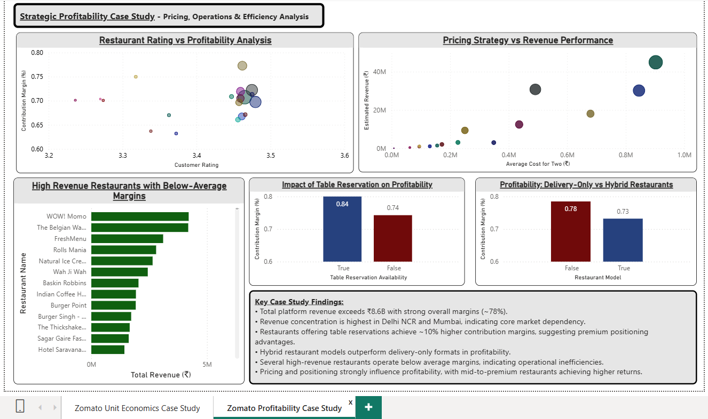

# 🍽 Zomato Restaurant Profitability Case Study

## 📊 Project Overview

This Case Study analyzes **restaurant profitability and unit economics** using **MySQL and Power BI**.

The project focuses on:

- Revenue performance
- Contribution margins
- Pricing strategy
- Restaurant profitability
- Business drivers

This project demonstrates a **complete end-to-end data analytics workflow**:

MySQL → Power BI

---

## 🎯 Business Problem

Zomato needs to understand:

- Which cities generate the highest revenue
- Which restaurants are profitable
- How pricing affects revenue
- Impact of reservations on profitability
- Delivery-only vs hybrid performance

This project answers key business questions:

- Where does most revenue come from?
- Which restaurants are loss-making?
- What drives profitability?
- Does pricing influence revenue?
- How restaurant models compare?

---

## 📊 Dataset

Dataset contains:

- 200,000+ Restaurants
- Multiple Cities
- Restaurant Ratings
- Cost for Two
- Delivery Options
- Table Reservations
- Revenue Estimates
- Contribution Margins

---

## 🛠 Tools Used

### MySQL

Used for:

- Database creation
- Data cleaning
- Feature engineering
- Case study analysis
- Business queries
- Analytical views

### Power BI

Used for:

- KPI dashboards
- Profitability analysis
- Pricing analysis
- City performance analysis
- Business insights

---

## 🏗 Project Workflow

### Step 1 — Database Setup

Created:

- zomato_restaurants_raw
- zomato_restaurants_clean
- zomato_unit_economics

SQL File:

01_Create_Database_And_Table.sql

---

### Step 2 — Data Loading

Loaded raw restaurant dataset.

SQL File:

02_Data_Loading.sql

---

### Step 3 — Data Quality Checks

Checked:

- Missing values
- Invalid ratings
- Duplicate restaurants

SQL File:

03_Data_Quality_Checks.sql

---

### Step 4 — Data Cleaning

Cleaned:

- Ratings
- Cost values
- Text columns

SQL File:

04_Data_Cleaning.sql

---

### Step 5 — Feature Engineering

Created:

- Profitability metrics
- Estimated revenue
- Contribution margins

SQL File:

05_Feature_Engineering.sql

---

### Step 6 — Analytical Views

Created:

- Revenue views
- Margin views
- KPI views

SQL File:

06_Analytical_Views.sql

---

### Step 7 — Case Study Analysis

Built:

- City performance analysis
- Profitability analysis
- Pricing analysis

SQL File:

07_Case_Study_Analysis.sql

---

### Step 8 — Advanced Business Queries

Built:

- Profitability drivers
- Pricing impact analysis
- Revenue segmentation

SQL File:

08_Advanced_Business_Queries.sql

---

### Step 9 — Business Insights

Generated:

- Key business insights
- Strategic findings

SQL File:

09_Business_Insights.sql

---

## 📊 Dashboard Preview

### Zomato Unit Economics Case Study

---

### Zomato Profitability Case Study

---

## 📈 Dashboard Features

### Page 1 — Unit Economics Overview

KPIs:

- Total Platform Revenue
- Total Contribution Profit
- Average Contribution Margin
- Unprofitable Restaurants

Charts:

- Revenue by City
- Margin by City
- Revenue vs Profitability

---

### Page 2 — Profitability Analysis

Charts:

- Rating vs Profitability
- Pricing vs Revenue
- Reservation Impact
- Delivery Model Profitability
- High Revenue Low Margin Restaurants

---

## 📌 Key Insights

### Revenue

- Delhi NCR and Mumbai generate highest revenue.

### Profitability

- Some high revenue restaurants operate at low margins.

### Pricing Strategy

- Mid-to-premium restaurants generate higher revenue.

### Reservations

- Restaurants with reservations achieve higher margins.

### Delivery Model

- Hybrid restaurants outperform delivery-only restaurants.

---

## 📂 Project Structure

Zomato-Analytics-Project

├── Data

├── SQL

├── PowerBI

├── Screenshots

└── README.md

---

## ⭐ Project Type

Case Study Data Analytics Project

Includes:

- Structured SQL Workflow
- Business Analysis
- Power BI Dashboard
- Strategic Insights

---

## 👨‍💻 Author

Aatreya Pal

Aspiring Data Analyst

Skills:

- SQL
- Power BI
- Excel
- Python
