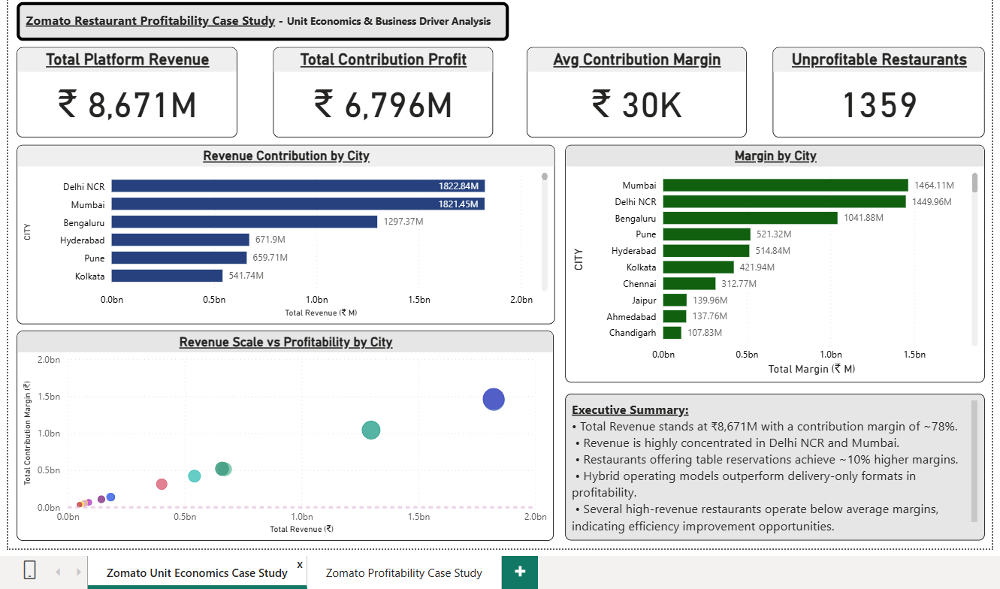
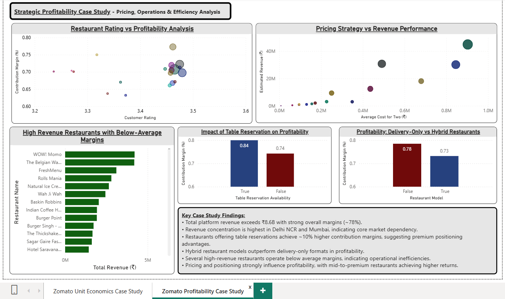

# 🍽️ Zomato Restaurant Analytics — SQL & Power BI Case Study

> **Portfolio project:** End-to-end restaurant analytics focused on performance, customer value, pricing proxies, operational adoption, and business decision-making.

**Tools:** MySQL • Power BI • SQL • Data Quality • Business Analytics

---

## 🎯 Executive Summary

This project demonstrates how a Data Analyst can take restaurant data through a structured analytical workflow and turn it into business insights.

The analysis focuses on:

- Restaurant and location performance
- Revenue and order-value metrics
- Restaurant portfolio segmentation
- Rating and customer-engagement signals
- Pricing proxies such as cost-for-two
- Online-order and table-booking adoption
- Data-quality and integrity checks
- Executive Power BI reporting

> **Important:** Revenue, order-value, and profitability-style metrics are project-derived analytical measures. They are not Zomato's internal financial figures.

---

## 🧠 Business Questions

The project is organized around questions a restaurant-platform analytics team could investigate:

1. Which restaurants and locations contribute the most revenue/order value?
2. How concentrated is revenue across the restaurant portfolio?
3. Which restaurant segments combine high volume and high customer value?
4. How do ratings relate to order activity?
5. How does listed cost-for-two vary across markets and cuisines?
6. How widely are online ordering and table booking adopted?
7. Which locations have a large restaurant base but weaker performance?
8. Which restaurants should be prioritized for further investigation?

Full question framework: [`Documentation/BUSINESS_QUESTIONS.md`](Documentation/BUSINESS_QUESTIONS.md)

---

## 🔄 Analytical Workflow

```text
Source Data
    ↓
Data Profiling & Quality Checks
    ↓
Cleaning & Standardization
    ↓
Feature Engineering
    ↓
SQL Analytical Views
    ↓
Advanced Business Analysis
    ↓
KPI / Segmentation Framework
    ↓
Power BI Dashboard
    ↓
Insights & Recommendations
```

---

## 🛠️ Technical Skills Demonstrated

### SQL / MySQL

- Relational schema design
- Data loading
- Data-quality checks
- Data cleaning
- Joins
- CTEs
- Subqueries
- Conditional aggregation
- Window functions
- `RANK`, `ROW_NUMBER`, `LAG`, running totals
- Revenue concentration / Pareto analysis
- Portfolio segmentation
- Analytical views

### Power BI

- KPI reporting
- Business dashboards
- City/location analysis
- Restaurant segmentation
- Profitability-style analysis
- Pricing analysis
- Interactive business reporting

### Analytics

- KPI definition
- Data validation
- Descriptive analysis
- Segmentation
- Business interpretation
- Recommendation framing

---

## 📊 Dashboard

### Page 1 — Unit Economics Overview

Focus areas:

- Platform-level KPIs
- Revenue by city
- Margin / profitability-style metrics
- Revenue vs. performance



### Page 2 — Restaurant Performance & Profitability

Focus areas:

- Rating vs performance
- Pricing vs revenue
- Reservation availability
- Delivery-model comparison
- High-revenue / low-margin investigation



---

## 🧮 SQL Analysis Highlights

### 1. Revenue Concentration

Ranks restaurants by revenue and calculates each restaurant's share and cumulative contribution using window functions.

### 2. Portfolio Segmentation

Classifies restaurants into:

- High Volume / High Value
- High Volume / Low Value
- Low Volume / High Value
- Low Volume / Low Value

### 3. Location Performance

Compares restaurant count, order volume, revenue and average order value by location.

### 4. Cuisine Performance

Evaluates restaurant supply, ratings, order volume and revenue by cuisine.

### 5. Rating vs Activity

Compares restaurant performance across rating bands while explicitly treating the relationship as observational rather than causal.

### 6. Digital Adoption

Measures online-order and table-booking adoption by location.

See [`SQL/10_Portfolio_Analysis.sql`](SQL/10_Portfolio_Analysis.sql).

---

## 🔎 Data Quality

The project includes checks for:

- Missing values
- Invalid ratings
- Negative transaction amounts
- Duplicate restaurant candidates
- Orphaned orders
- Orphaned order items
- Invalid review ratings
- Referential integrity
- Overall quality status

See [`SQL/11_Data_Quality_Report.sql`](SQL/11_Data_Quality_Report.sql).

---

## 📚 Documentation

| Document | Purpose |
|---|---|
| [`BUSINESS_QUESTIONS.md`](Documentation/BUSINESS_QUESTIONS.md) | Business questions and decision framework |
| [`DATA_DICTIONARY.md`](Documentation/DATA_DICTIONARY.md) | Field and metric definitions |
| [`ASSUMPTIONS_AND_LIMITATIONS.md`](Documentation/ASSUMPTIONS_AND_LIMITATIONS.md) | Analytical assumptions and reproducibility notes |

---

## 📂 Project Structure

```text
Zomato-Analytics-Project/
│
├── Data/
│   └── india_all_restaurants_details.csv.zst
│
├── SQL/
│   ├── 01_Create_Database_And_Table.sql
│   ├── 02_Data_Loading.sql
│   ├── 03_Data_Quality_Checks.sql
│   ├── 04_Data_Cleaning.sql
│   ├── 05_Feature_Engineering.sql
│   ├── 06_Analytical_Views.sql
│   ├── 07_Case_Study_Analysis.sql
│   ├── 08_Advanced_Business_Queries.sql
│   ├── 09_Business_Insights.sql
│   ├── 10_Portfolio_Analysis.sql
│   └── 11_Data_Quality_Report.sql
│
├── PowerBI/
├── Screenshots/
│
├── Documentation/
│   ├── BUSINESS_QUESTIONS.md
│   ├── DATA_DICTIONARY.md
│   └── ASSUMPTIONS_AND_LIMITATIONS.md
│
└── README.md
```

---

## ⚠️ Reproducibility Note

The repository contains a compressed restaurant source file. The current SQL workflow also demonstrates a relational model containing restaurants, customers, orders, order items and reviews.

Before claiming the full workflow is reproducible directly from the compressed source, the source file must be decompressed and profiled, then its columns must be explicitly mapped to the SQL model.

This distinction is documented intentionally: **the project prioritizes analytical credibility over unsupported claims.**

---

## 💡 Business Interpretation Framework

The project follows:

**Metric → Pattern → Interpretation → Recommendation**

Example:

> **Finding:** A group of restaurants has high order volume but below-average order value.
>
> **Interpretation:** Volume alone does not guarantee high customer value.
>
> **Action:** Investigate menu mix, pricing and customer segments before prioritizing these restaurants for growth.

---

## 👨‍💻 Author

**Aatreya Pal**  
Aspiring Data Analyst

**Core skills:** SQL • Python • Advanced Excel • Power BI • Data Analysis

[LinkedIn](https://www.linkedin.com/in/aatreya-pal-403ba8237)
